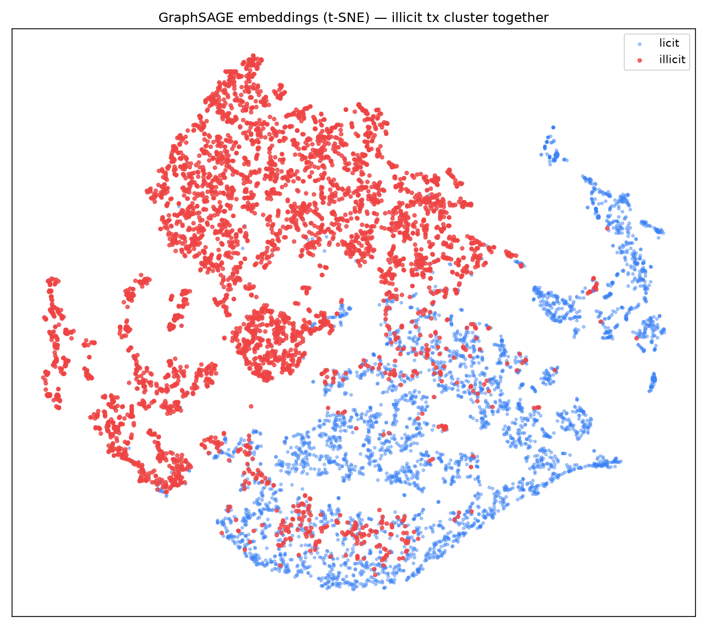

# NEMESIS — Autonomous Fraud Network Intelligence

> Detect fraud **rings** by learning the *structure* of how money moves — not by scoring transactions one at a time.

NEMESIS combines a **Graph Neural Network** that learns structural embeddings from transaction graphs with an **LLM reasoning layer** that narrates *why* a flagged cluster looks like a specific fraud typology (mule network, synthetic-identity farm, card-testing ring).

---

## The problem

A single $500 transfer is unremarkable. Forty accounts funneling money through one shared device in a circular flow is a **laundering ring** — but no per-transaction fraud model sees it, because the signal isn't in any one transaction. It's in the **shape** of the network.

Classic fraud detection scores rows independently. NEMESIS scores *structure*: it builds a graph of accounts, devices, and IPs, and asks a GNN to find the clusters whose connectivity looks anomalous — then hands those clusters to an LLM to explain the pattern in plain language and classify the typology.

## Architecture

```
Raw transactions (IEEE-CIS / PaySim)
        │
        ▼
Graph construction  ── accounts · devices · IPs as nodes
                       transfers & shared attributes as edges
        │
        ▼
GNN (GraphSAGE → GAT) ── learns embeddings, flags structurally
                          anomalous clusters
        │
        ▼
LLM reasoning (LangGraph) ── narrates WHY a cluster is suspicious,
                             classifies typology + confidence
        │
        ▼
FastAPI backend  ⇆  React frontend (force-directed graph, click-to-inspect)
```

### Graph schema (frozen)

Heterogeneous graph — each entity type carries its own feature space rather than being flattened into one:

| Element | Type | Notes |
|---|---|---|
| **Node** | `account` | age, tx velocity (1h/24h), avg/std amount, distinct devices/IPs |
| **Node** | `device` | distinct accounts seen, first-seen age |
| **Node** | `ip` | distinct accounts seen, first-seen age |
| **Edge** | `transaction` | account → account, directed & weighted (amount, time, type) |
| **Edge** | `shared_device` | account — device |
| **Edge** | `shared_ip` | account — IP |

The fraud signal concentrates in the *shared* edges — rings reuse devices and IPs in ways a normal user base does not.

## Tech stack

- **Graph / ML** — PyTorch, PyTorch Geometric (GraphSAGE, GAT), NetworkX (prototyping)
- **Data** — Elliptic Bitcoin Dataset (primary: 203k tx nodes, real illicit labels), IEEE-CIS Fraud Detection (real-world tabular baseline)
- **Reasoning** — LangGraph, Groq `llama-3.3-70b`
- **Backend** — FastAPI, SQLite
- **Frontend** — React + react-force-graph / d3
- **Deploy** — Docker, Render

## Status & roadmap

| Phase | Scope | Status |
|---|---|---|
| **0 — Foundation** | Env, frozen graph schema, repo scaffold, data acquisition | ✅ Complete |
| **1 — Graph construction** | Elliptic CSVs → PyG `Data` (203k nodes, 234k edges, 166 features, validated) | ✅ Complete |
| **2 — GNN model** | GraphSAGE baseline (+ GAT); temporal split; class-imbalance handling. **Test ROC-AUC 0.879, illicit F1 0.53**; embeddings visibly cluster illicit tx under t-SNE | ✅ Complete |
| **3 — Reasoning layer** | LangGraph pipeline classifies typology with a visible reasoning chain | ⬜ Planned |
| **4 — API + visualization** | FastAPI endpoints + React force-directed graph demo | ⬜ Planned |
| **5 — Validation case** | Reconstruct a documented real-world mule/laundering typology and show NEMESIS flags it | ⬜ Planned |
| **6 — Polish + deploy** | Docker (non-root), Render deploy | ⬜ Planned |

### Phase 2 proof — embeddings learn the ring structure

The GNN is never told where the rings are. Yet when its learned node embeddings
are projected to 2D, illicit transactions (red) separate cleanly from licit
ones (blue) — evidence the model learned *structure*, not per-transaction noise:



Evaluation follows the canonical leakage-free **temporal split** (train on early
time steps, test on later ones). The visible val→test metric drop is the
well-documented Elliptic *dark-market shutdown* at time step ~43 — a genuine
distribution shift, not a modeling artifact.

## Repository layout

```
backend/
  graph/      # tabular → graph: schema.py (frozen), build_graph.py, features.py
  models/     # GraphSAGE, GAT, train, evaluate  (Phase 2)
  reasoning/  # LangGraph typology classification  (Phase 3)
  api/        # FastAPI routes  (Phase 4)
  db/         # SQLite models + session
data/         # raw → processed → graphs  (gitignored; large & licensed)
frontend/     # React graph visualization  (Phase 4)
validation/   # documented real-world case study  (Phase 5)
scripts/      # download_data.sh, build_all_graphs.py, deploy helpers
notebooks/    # EDA, graph sanity checks, embedding evaluation
```

## Getting started

```bash
python -m venv .venv && source .venv/Scripts/activate   # Windows: .venv\Scripts\activate
pip install -r backend/requirements.txt

cp .env.example .env        # add your GROQ_API_KEY
bash scripts/download_data.sh   # needs ~/.kaggle/kaggle.json + accepted IEEE-CIS rules
```

---

*Roadmap ahead:* temporal graph modeling (transactions as a stream, not a snapshot) and cross-institution federated detection — catching rings that span banks without sharing raw customer data.
