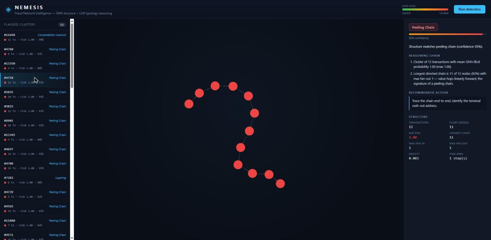

# NEMESIS — Autonomous Fraud Network Intelligence

> Detect fraud **rings** by learning the *structure* of how money moves — not by scoring transactions one at a time.

NEMESIS combines a **Graph Neural Network** that learns structural embeddings from transaction graphs with an **LLM reasoning layer** that narrates *why* a flagged cluster looks like a specific fraud typology (mule network, synthetic-identity farm, card-testing ring).

---

## The problem

A single $500 transfer is unremarkable. Forty accounts funneling money through one shared device in a circular flow is a **laundering ring** — but no per-transaction fraud model sees it, because the signal isn't in any one transaction. It's in the **shape** of the network.

Classic fraud detection scores rows independently. NEMESIS scores *structure*: it builds a graph of accounts, devices, and IPs, and asks a GNN to find the clusters whose connectivity looks anomalous — then hands those clusters to an LLM to explain the pattern in plain language and classify the typology.

## Architecture

```
Elliptic Bitcoin transactions (203k nodes · 234k flows · 166 features)
        │
        ▼
Graph construction  ── each Bitcoin transaction is a node,
                       each flow (tx → tx) a directed edge
        │
        ▼
GNN (GraphSAGE → GAT) ── learns embeddings, scores every node's
                          illicit risk, flags high-risk clusters
        │
        ▼
LLM reasoning (LangGraph) ── narrates WHY a cluster is suspicious,
                             classifies laundering typology + confidence
        │
        ▼
FastAPI backend  ⇆  React frontend (force-directed graph, click-to-inspect)
```

### Graph schema

NEMESIS runs on the **Elliptic Bitcoin Dataset** — a *homogeneous* directed graph
where every node is a Bitcoin transaction and every edge is a flow of value:

| Element | Type | Notes |
|---|---|---|
| **Node** | `transaction` | 166 features: 1 time step + 93 local (volume, fees, in/out counts) + 72 aggregated 1-hop neighborhood features |
| **Edge** | `flow` | transaction → transaction, directed (value moving forward through the chain) |
| **Label** | `class` | illicit / licit / unknown — 4,545 illicit among 46,564 labeled (9.8%); 157k unlabeled |

> **Design note — the pivot.** The project was scoped for a *heterogeneous*
> account/device/IP graph on IEEE-CIS/PaySim. Data inspection killed that plan:
> PaySim has no device/IP columns and a degenerate fan-in topology (no rings),
> and neither source cleanly populated the intended schema. Elliptic is real
> Bitcoin data with genuine illicit ring structure and strong clustering — so
> the schema became homogeneous tx→tx. The *thesis* (detect fraud by structure,
> explain it with an LLM) is unchanged; the substrate got more defensible.

## Tech stack

- **Graph / ML** — PyTorch, PyTorch Geometric (GraphSAGE, GAT), NetworkX (prototyping)
- **Data** — Elliptic Bitcoin Dataset (primary: 203k tx nodes, real illicit labels), IEEE-CIS Fraud Detection (real-world tabular baseline)
- **Reasoning** — LangGraph, Groq `llama-3.3-70b`
- **Backend** — FastAPI, SQLite
- **Frontend** — React + react-force-graph / d3
- **Deploy** — Docker, Render

## Status & roadmap

| Phase | Scope | Status |
|---|---|---|
| **0 — Foundation** | Env, frozen graph schema, repo scaffold, data acquisition | ✅ Complete |
| **1 — Graph construction** | Elliptic CSVs → PyG `Data` (203k nodes, 234k edges, 166 features, validated) | ✅ Complete |
| **2 — GNN model** | GraphSAGE baseline (+ GAT); temporal split; class-imbalance handling. **Test ROC-AUC 0.879, illicit F1 0.53**; embeddings visibly cluster illicit tx under t-SNE | ✅ Complete |
| **3 — Reasoning layer** | LangGraph pipeline classifies typology with a visible reasoning chain | ⬜ Planned |
| **4 — API + visualization** | FastAPI (ingest / detect / clusters) + SQLite; React force-directed graph, color-coded by risk, click-to-inspect reasoning | ✅ Complete |
| **5 — Validation case** | Peel-chain typology reconstructed from real illicit features; NEMESIS flags it (risk 0.85) + classifies `peeling_chain` @ 0.95 | ✅ Complete |
| **6 — Polish + deploy** | Non-root Docker (backend + nginx frontend), docker-compose, Render deploy helper | ✅ Complete |

### The demo

The GNN flags structurally anomalous transaction clusters; the reasoning layer
classifies each one's laundering typology with an auditable reasoning chain. The
React front-end draws each flagged cluster as a force-directed graph (nodes
colored by GNN risk) with a click-to-inspect verdict panel:



*Above: a flagged cluster the GNN scored at ~1.0 illicit risk, classified as a
**peeling chain** — the front-end renders the 12-transaction linear flow while
the inspector cites the structural evidence (longest directed chain 11 of 12
nodes, fan-out 1). Other clusters surface as **consolidation cash-outs**
(many-to-one hubs) and **layering** patterns.*

### Phase 2 proof — embeddings learn the ring structure

The GNN is never told where the rings are. Yet when its learned node embeddings
are projected to 2D, illicit transactions (red) separate cleanly from licit
ones (blue) — evidence the model learned *structure*, not per-transaction noise:


Evaluation follows the canonical leakage-free **temporal split** (train on early
time steps, test on later ones). The visible val→test metric drop is the
well-documented Elliptic *dark-market shutdown* at time step ~43 — a genuine
distribution shift, not a modeling artifact.

## Repository layout

```
backend/
  graph/      # tabular → graph: schema.py (frozen), build_graph.py, features.py
  models/     # GraphSAGE, GAT, train, evaluate  (Phase 2)
  reasoning/  # LangGraph typology classification  (Phase 3)
  api/        # FastAPI routes  (Phase 4)
  db/         # SQLite models + session
data/         # raw → processed → graphs  (gitignored; large & licensed)
frontend/     # React graph visualization  (Phase 4)
validation/   # documented real-world case study  (Phase 5)
scripts/      # download_data.sh, build_all_graphs.py, deploy helpers
notebooks/    # EDA, graph sanity checks, embedding evaluation
```

## Getting started

**Docker (whole stack):**

```bash
docker compose up --build      # backend :8000, frontend :5173
```

The read API serves flagged clusters from a committed detection snapshot, so the
demo runs without downloading the 135 MB graph. Set `GROQ_API_KEY` to swap the
structural heuristic for live LLM narration.

**Local dev:**

```bash
python -m venv .venv && source .venv/Scripts/activate   # Windows: .venv\Scripts\activate
pip install -r backend/requirements.txt
cp .env.example .env                                    # optional: add GROQ_API_KEY

# with the Elliptic graph built (data/graphs/elliptic.pt):
python -m backend.models.train        # train GraphSAGE  (or --model gat)
python -m backend.models.evaluate     # test metrics + embeddings
python -m backend.api.detection       # build detection snapshot
uvicorn backend.main:app --reload     # API at http://localhost:8000

cd frontend && npm install && npm run dev   # UI at http://localhost:5173
```

**Tests:** `pytest backend/tests validation/replay_test.py`

## S-tier roadmap

Where NEMESIS goes beyond a snapshot classifier:

- **Temporal graph modeling** — treat transactions as a *stream* rather than a
  49-step snapshot (EvolveGCN / temporal attention), so rings are caught as they
  form instead of after the fact. The Elliptic time steps are already the seam
  for this.
- **Cross-institution federated detection** — many laundering rings span banks;
  no single institution sees the whole graph. Federated / privacy-preserving GNN
  training would surface cross-bank rings without sharing raw customer data.
- **Live ingestion → incremental re-scoring** — the `/api/ingest` contract is in
  place; the next step is splicing new transactions into the graph and re-scoring
  only the affected neighborhood.
- **Amount-aware peel detection** — Elliptic anonymizes amounts; on a source with
  real values, weight the reasoning layer by the *peel ratio* per hop.

---

*Roadmap ahead:* temporal graph modeling (transactions as a stream, not a snapshot) and cross-institution federated detection — catching rings that span banks without sharing raw customer data.
